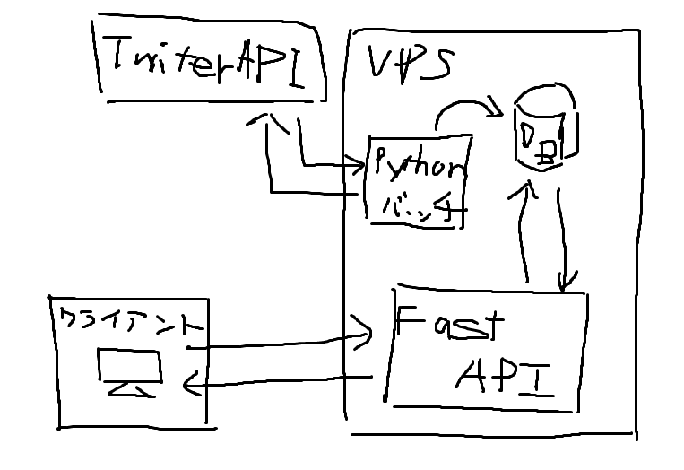

またよくわからないことをしている。

### 新しいフォルダー (2)

俺のTwitterのリストに[新しいフォルダー (2)](https://twitter.com/i/lists/1240618055467536384)っていうのがあるんだけど、それはTwitterのタイムラインに流れてきたエチチ画像を上げてる絵師さんを突っ込みまくっているリストなんだ。いわば俺のインターネットエチチ画像フォルダーなわけで、たまに眺めてたりするんだけど、リストのタイムラインなのでもちろん普通のツイートも流れてくる。俺はエチチ画像だけが見たいのに。

個人のタイムラインにはメディアだけを表示するタブがあると思うけど、リストにはそういうものがない（はず）。なのでなんとかして画像だけが流れるタイムラインみたいなのが作れないかと思って始めたのが、新しいフォルダープロジェクトだ。生み出されたものはそれほどたいしたものでもないんだけど、記念に記事を書いておく。

### 作り

公開するページはgithub pagesにそのまま置くのと、生htmlを置きたかったので、web上で動的にTwitterAPIを叩くようなことはできなさそうだと思った。だからあらかじめTwitterAPを叩いておいて、webサイトでは溜めておいたデータだけを取ってくるようなあんまり賢くないような設計になってる。

##### Pythonバッチ

TwitterAPIはPythonで叩いてVPS上のDBに突っ込んでる。systemdで30分毎に定期実行してる。

##### FastAPI

溜めたデータはFastAPIを使って取ってこれるようにした。よくわからんけどナウいフレームワークらしい。

### 公開サイト

[https://putcut.net/newfolder2](https://putcut.net/newfolder2)

生JavaScriptにエンドポイントも載ってる。

### まとめ

半分は上で書いたのが理由で、もう半分は仕事でAPIをよく触るので勉強も兼ねて。久しぶりになんか作った気がするけど普通に楽しかった。でもやればやるほど技術はわからんすぎる。むずかったのはJavaScrpitとSSL認証とかドメインとか云々。なんもわからんわ。TwitterAPIのこともなんも考えてないので多分よけいなものも取ってきているしうまく取れてない画像もあるんだろうな。あとエチチコンテンツなのでgithubの規約に違反してるような気もするが銅なんでしょうか。ほかの人のエチチ画像フォルダーも見たいんだがそういうサービスってあるんだっけｗ